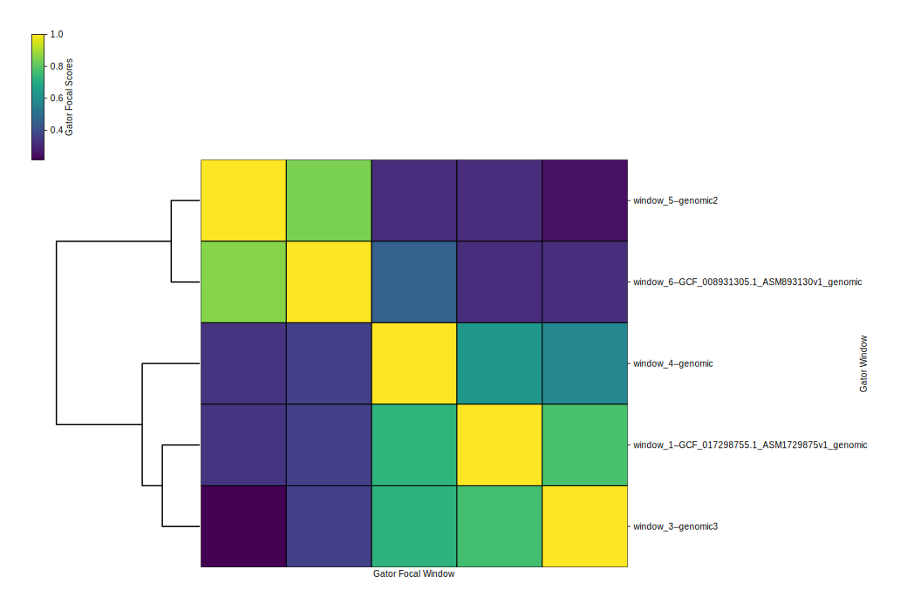
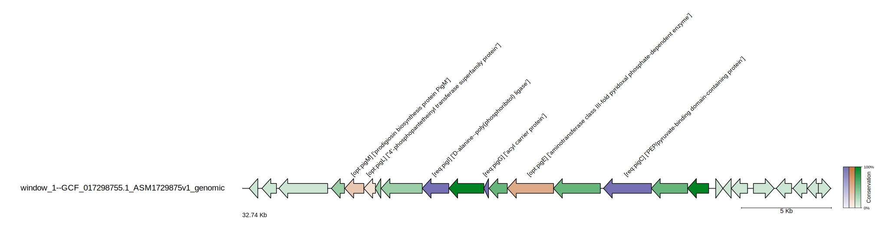
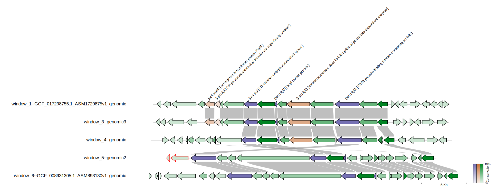

# GATOR-GC: Genomic Assessment Tool for Orthologous Regions and Gene Clusters


## Overview


GATOR-GC is a user-friendly algorithm designed for targeted exploration of BGC and genomic islands diversity. It focuses on key biosynthetic enzymes and offers flexibility in defining the taxonomic scope of the analysis. Unlike methods relying on arbitrary cutoffs, GATOR-GC establishes BGC boundaries based on evolutionary principles and implements an enzyme-aware scoring system for assessing BGC-BGC distances, moving beyond a binary presence-absence framework. This approach enhances the tool's capability to identify and prioritize novelty, effectively mapping biosynthetic diversity into distinct groups

You can find our preprint on [bioRxiv](https://www.biorxiv.org/content/10.1101/2025.02.24.639861v1)
## Authors

- Code, design, and development: José D. D. Cediel-Becerra,  Marc G. Chevrette
- Afiliation: Microbiology & Cell Science Deparment, University of Florida
- Please contact José at jcedielbecerra@ufl.edu if there are any issues

## Features

- **Targeted Search:** Conduct targeted searches for essential key enzymes and optional tailor enzymes within Biosynthetic Gene Clusters (BGCs) and genomic islands, streamlining the discovery process
- **Modular Domain Screening:** Automatically screen user-provided protein files to identify critical modular domains, such as Non-Ribosomal Peptide Synthetases (NRPSs) and Polyketide Synthases (PKSs), using state-of-the-art HMM profiles from antiSMASH for unparalleled precision
- **Customizable Parameters:**  Customize search parameters to include required and optional proteins, ensure complete assembly with all necessary proteins, and define specific distances between required proteins. This customization enhances the specificity of GATOR window identification, offering tailored analysis to meet research needs
- **Dereplication for Gator Windows:** Remove identical Gator Windows to avoid redundant calculations in subsequent steps, while keeping track of which windows are duplicates
- **GATOR Focal Scores:** Employ a novel enzyme-aware scoring system to accurately compare GATOR windows against targeted focal windows. This approach ensures precise evaluation of genomic contexts and enzyme functionalities
- **GATOR Conservation:**  Generate dynamic gene cluster diagrams that visually differentiate between required and optional proteins using color coding. Transparency levels indicate the gene's presence within GATOR windows, providing a clear visual representation of gene conservation
- **GATOR Neighborhoods:** Visualize each GATOR window's genomic neighborhood with organized tracks based on GATOR focal scores. Homology between genes is intuitively illustrated with gray bars, facilitating easy understanding of genetic relationships and conservation

## Installation

Installation can be performed via conda and should take ~5 minutes

```bash
# 1. clone the repository:
git clone https://github.com/chevrettelab/gator-gc.git
cd gator-gc/

# 2. create conda environment using yaml file and activate it. Use mamba instead of conda for faster installation:
   # with conda:
   conda env create -f gator-gc_env.yml
   conda activate gator-gc

   # or with mamba:
   mamba env create -f gator-gc_env.yml
   conda activate gator-gc	

# 3. install the python package
pip install .
```

## Usage

Before utilizing gator-gc, it's necessary to execute pre-gator-gc to obtain the the diamond database, and the modular domain table output.

```
usage: pre-gator-gc [-h] -g  [...] [-b] [-e] [-t] -o  [-v]

                                                                                                                                                                     
     -\ ---\--\ -------\ ----\ ---\--\ ---\ --\ ----\ ----\--------\ /---                         
   /--/ ---/--/ -------/ ----/ ---/--/ ---/ --/ ----/ ----/--------/ \----\                                                                    
  ________   _____  __________________  __________         _________________                                                                                
 /  _____/  /  _  \ \__    ___/_____  \ \______   \       /  _____/\_   ___ \                                                                     
/   \  ___ /  /_\  \  |    |   /   |   \ |       _/ _____    \  ___/    \  \/                     
\    \_\  \    |    \ |    |  /    |    \|    |   \/_____/    \_\  \     \_____                   
 \______  /____|__  / |____|  \_______  /|____|_  /       \______  /\_______  /                  
        \/        \/                  \/        \/               \/         \/                                                            
    -----\--\ -------\ ----\ ---\--\ ---\ --\ ------\ ----\---------\ /----                                                               
    \----/--/ -------/ ----/ ---/--/ ---/ --/ ------/ ----/---------/ \----/                                                                       

GATOR-GC: Genomic Assessment Tool for Orthologous Regions and Gene Clusters                                                                               
Developer: José D. D. Cediel-Becerra
Afiliation: Microbiology & Cell Science Deparment, University of Florida                                                                              
Please contact José at jcedielbecerra@ufl.edu if you have any issues                                                                                       
Version: v0.9.0

optional arguments:
  -h, --help  show this help message and exit
  -v          Enable verbose output (default: False).

Input Options:
  -g  [ ...]  Directories containing GenBank files (*.gbff/*.gbk/*.gb). You can specify multiple directories separated by spaces. Directories can be specified with or without wildcards.
  -b          Number of GenBank files to process before writing the protein database (default: process all files at once).

HMMER Options:
  -e          E-value threshold for HMMER hmmsearch (default: 1e-4).
  -t          Number of CPU threads to use for parsing genome files and for hmmsearch (default: all available threads).

Output Options:
  -o          Directory where the gator databases (protein,  DIAMOND, and modular domtblout databases) will be saved.
``` 
```
Now we can run gator-gc to identify the gator windows. 

```
usage: gator-gc [-h] -rq  [-op] -g  [...] -d  [-t] [-us] [-qc] [-idt] [-bs] [-k] [-e] [-rd] [-we] -o  [-nc] [-nn] [-v]

     -\ ---\--\ -------\ ----\ ---\--\ ---\ --\ ----\ ----\--------\ /--- 
   /--/ ---/--/ -------/ ----/ ---/--/ ---/ --/ ----/ ----/--------/ \----\ 
  ________   _____  __________________  __________         _________________  
 /  _____/  /  _  \ \__    ___/_____  \ \______   \       /  _____/\_   ___ \ 
/   \  ___ /  /_\  \  |    |   /   |   \ |       _/ _____    \  ___/    \  \/ 
\    \_\  \    |    \ |    |  /    |    \|    |   \/_____/    \_\  \     \_____
 \______  /____|__  / |____|  \_______  /|____|_  /       \______  /\_______  /
        \/        \/                  \/        \/               \/         \/ 
    -----\--\ -------\ ----\ ---\--\ ---\ --\ ------\ ----\---------\ /----
    \----/--/ -------/ ----/ ---/--/ ---/ --/ ------/ ----/---------/ \----/

GATOR-GC: Genomic Assessment Tool for Orthologous Regions and Gene Clusters
Developer: José D. D. Cediel-Becerra
Afiliation: Microbiology & Cell Science Deparment, University of Florida
Please contact José at jcedielbecerra@ufl.edu if you have any issues
Version:v0.9.0

optional arguments:
  -h, --help  show this help message and exit
  -v          Enable verbose output. (Default: False)

Input Options:
  -rq         Path to the query protein FASTA file containing required proteins.
  -op         Path to the query protein FASTA file containing optional proteins.
  -g  [ ...]  Directory containing the Genbank files (*.gbff/*.gbk/*.gb).You can specify multiple directories separated by spaces. Directories can be specified with or without wildcards.
  -d          Directory containing the PRE-GATOR-GC databases (.dmnd and .domtblout files). (Required)

Diamond Options:
  -t          Number of CPUs to use for diamond search and hmmsearch. (Default: all available CPUs)
  -us         Enable ultra-sensitive DIAMOND alignment. This overrides query cover and protein percent values only for the window search.(Default: False)
  -qc         Minimum percent query cover for diamond search (Default: 70). if ultra sensitive was enabled, query cover value is used only for all vs all comparisons
  -idt        Minimum percent identity for diamond search. (Default: 35). if ultra sensitive was enabled, percent identity value is used only for all vs all comparisons
  -bs         DIAMOND block size. It controlls DIAMOND memory and disk space. For large datasets, increase this but keep an eye on memory and disk (Default: 2)
  -k          Number of target sequences. (Default: 1e50)

HMMER Options:
  -e          E-value threshold for hmmsearch. (Default: 1e-4)

GATOR-GC Options:
  -rd         Maximum distance in kilobases between required genes to define a gator window. (Default: 86 kb)
  -we         Extension in kilobases from the start and end positions of the gator windows. (Default: 10 kb)

Output Options:
  -o          Directory to save GATOR-GC results.
  -nc         Disable creation of GATOR conservation figures.
  -nn         Disable creation of GATOR neighborhoods figures.
```

## Example

Let's explore an example involving the enzymes responsible for the production of prodigiosin and prodigiosin-like compounds, categorizing them as required and optional. Subsequently, we will define the taxonomic scope of the search, focusing  on a couple genomes from *Streptomyces*, *Serratia*, *Pseudoalteromonas*, and *Hallela*.
The inital step involves using pre-gator-gc:

```
pre-gator-gc -g example/genomes/ -o output_name_gator_databases -v

```
after running pre-gator-gc on this example and using the verbose flag, we will see:

```
     -\ ---\--\ -------\ ----\ ---\--\ ---\ --\ ----\ ----\--------\ /---                         
   /--/ ---/--/ -------/ ----/ ---/--/ ---/ --/ ----/ ----/--------/ \----\                                                                    
  ________   _____  __________________  __________         _________________                                                                                
 /  _____/  /  _  \ \__    ___/_____  \ \______   \       /  _____/\_   ___ \                                                                     
/   \  ___ /  /_\  \  |    |   /   |   \ |       _/ _____    \  ___/    \  \/                     
\    \_\  \    |    \ |    |  /    |    \|    |   \/_____/    \_\  \     \_____                   
 \______  /____|__  / |____|  \_______  /|____|_  /       \______  /\_______  /                  
        \/        \/                  \/        \/               \/         \/                                                            
    -----\--\ -------\ ----\ ---\--\ ---\ --\ ------\ ----\---------\ /----                                                               
    \----/--/ -------/ ----/ ---/--/ ---/ --/ ------/ ----/---------/ \----/                                                                       

GATOR-GC: Genomic Assessment Tool for Orthologous Regions and Gene Clusters                                                                               
Developer: José D. D. Cediel-Becerra
Afiliation: Microbiology & Cell Science Deparment, University of Florida                                                                              
Please contact José at jcedielbecerra@ufl.edu if you have any issues                                                                                       
Version: v0.9.0
[1] - 2025-03-26 13:26:19,104 - INFO - The output_name_gator_databases directory was created successfully.
[2] - 2025-03-26 13:26:19,104 - INFO - Total genome files found: 10
[3] - 2025-03-26 13:26:23,330 - INFO - Processed 10/10 files (100.00% complete)
[4] - 2025-03-26 13:26:23,426 - INFO - Protein database created at output_name_gator_databases/output_name_gator_databases.faa
[5] - 2025-03-26 13:26:23,784 - INFO - Successfully created the gator DIAMOND database to output_name_gator_databases/output_name_gator_databases.dmnd
[6] - 2025-03-26 13:26:30,953 - INFO - Successfully created the gator domtblout database to output_name_gator_databases/output_name_gator_databases.domtblout
[7] - 2025-03-26 13:26:30,953 - INFO - Execution time: 11.85 seconds
```

With this foundation in place, we can proceed to use gator-gc to search gene clusters (a.k.a GATOR windows) harboring the wanted genes. We can do it running these arguments:

```
gator-gc -rq example/proteins/req.faa -op example/proteins/opt.faa -g example/genomes/ -d output_name_gator_databases/ -v -o results

```
after running gator-gc on this example and using the verbose flag, we will see:

```
     -\ ---\--\ -------\ ----\ ---\--\ ---\ --\ ----\ ----\--------\ /--- 
   /--/ ---/--/ -------/ ----/ ---/--/ ---/ --/ ----/ ----/--------/ \----\ 
  ________   _____  __________________  __________         _________________  
 /  _____/  /  _  \ \__    ___/_____  \ \______   \       /  _____/\_   ___ \ 
/   \  ___ /  /_\  \  |    |   /   |   \ |       _/ _____    \  ___/    \  \/ 
\    \_\  \    |    \ |    |  /    |    \|    |   \/_____/    \_\  \     \_____
 \______  /____|__  / |____|  \_______  /|____|_  /       \______  /\_______  /
        \/        \/                  \/        \/               \/         \/ 
    -----\--\ -------\ ----\ ---\--\ ---\ --\ ------\ ----\---------\ /----
    \----/--/ -------/ ----/ ---/--/ ---/ --/ ------/ ----/---------/ \----/

GATOR-GC: Genomic Assessment Tool for Orthologous Regions and Gene Clusters
Developer: José D. D. Cediel-Becerra
Afiliation: Microbiology & Cell Science Deparment, University of Florida
Please contact José at jcedielbecerra@ufl.edu if you have any issues
Version:v0.9.0
[1] - 2025-03-26 13:26:58,808 - INFO - The results directory was created successfully.
[2] - 2025-03-26 13:26:58,809 - INFO - Total genome files found: 10
[3] - 2025-03-26 13:26:59,421 - INFO - hmmsearch completed successfully. Output written to /mnt/clab1/GATOR-GC/20230922-gator_dev/gator-gc/results/all_merged_queries_q3q8ikxw.domtbl
[4] - 2025-03-26 13:26:59,421 - INFO - Parsing modular domtblout completed successfully. Found 1 proteins with domain hits.
[5] - 2025-03-26 13:26:59,421 - INFO - Protein dictionary  with boolean values set for is_nrps and is_pks completed successfully.
[6] - 2025-03-26 13:26:59,423 - INFO - Found Diamond database file: output_name_gator_databases/output_name_gator_databases.dmnd
[7] - 2025-03-26 13:26:59,423 - INFO - Found Domtblout database file: output_name_gator_databases/output_name_gator_databases.domtblout
[8] - 2025-03-26 13:26:59,434 - INFO - Parsing modular domtblout completed successfully. Found 582 proteins with domain hits.
[9] - 2025-03-26 13:26:59,435 - INFO - No need to integrate Hybrids, NRPS, and PKS hits into protein_dict.
[10] - 2025-03-26 13:26:59,435 - INFO - Running Diamond with /mnt/clab1/GATOR-GC/20230922-gator_dev/gator-gc/results/non_modular_queries_3jh_c944.faa against output_name_gator_databases/output_name_gator_databases.dmnd
[11] - 2025-03-26 13:27:00,504 - INFO - Successfully parsed diamond hits from /mnt/clab1/GATOR-GC/20230922-gator_dev/gator-gc/results/dmnd_out__604bbhi.txt and integrated to protein_dict
[12] - 2025-03-26 13:27:00,505 - INFO - Number of Windows Found: 6
[13] - 2025-03-26 13:27:00,506 - INFO - Processing gator windows, writing GenBank files for each window, FASTA database, and tracks metadata for visualization and analysis
[14] - 2025-03-26 13:27:07,826 - INFO - Successfully wrote gator table with metadata to results/windows_genbanks/gator_hits.tsv
[15] - 2025-03-26 13:27:07,871 - INFO - Starting deduplication process for gator windows.
[16] - 2025-03-26 13:27:10,697 - INFO - All windows have been processed and deduplicated.
[17] - 2025-03-26 13:27:10,698 - INFO - Number of unique gator windows after deduplication: 5
[18] - 2025-03-26 13:27:10,698 - INFO - Unique computations written to results/deduplication_data/unq_comp.tsv
[19] - 2025-03-26 13:27:11,341 - INFO - Gene level presence absence tables for deduplicated gator windows created sucessfully in results/presence_absence
[20] - 2025-03-26 13:27:11,351 - INFO - Gator focal scores tables for deduplicated gator windows created sucessfully in results/gator_scores
[21] - 2025-03-26 13:27:11,352 - INFO - Concatenated of gator focal scores across deduplicated gator windows created sucessfully in results/concatenated_scores/concatenated_gfs.csv
[22] - 2025-03-26 13:27:11,861 - INFO - Clustered heatmap with gator focal scores saved to results/concatenated_scores/clustermap_gfs.svg
[23] - 2025-03-26 13:27:14,759 - INFO - All gator conservation figures have been generated successfully.
[24] - 2025-03-26 13:27:26,010 - INFO - All gator neighborhood figures have been generated successfully.
[25] - 2025-03-26 13:27:26,010 - INFO - Execution time: 27.21 seconds
```

Six putative regions containing the required genes (pigC, pigG, and PigI) were identified, with a specified maximum distance between them of <86 kb (this default value can be adjusted using --rd. Additionally, a window extension of 10 Kb was applied (this default value can be modified using -we).

The output folder "results/" for gator-gc includes the following subfolders:

1. windows_genbanks: This folder contains six GenBank files, each generated for a specific window.
2. presence_absence: Within this folder, six gene-level presence-absence tables are present for each gator window in CSV format. The tables are named based on the window number and the corresponding GenBank filename. In these tables, the columns represent the locus_tags in the gator focal window, and the rows correspond to the gator windows.
3. gator_scores: This folder houses six tables with a structure similar to the presence-absence tables. However, instead of binary numbers, normal distributions were applied to each required and optional protein. The highest distribution value is set to 1, and these values were multiplied by the presence-absence values. The resulting sums for each gator window were then normalized based on the maximum sum score (gator focal window), generating the gator focal scores. The tables are named based on the window number and GenBank filenames.
4. concatenated_scores: This folder contains a "concatenated_GFS.csv" file, which consolidates all the gator focal scores. Additionally, a "clustermap_GFSs" file displays the distribution of gator windows based on the gator focal scores using a heatmap and a dendrogram. This figure is a high-quality vectorized representation.


5. gator_conservation_plots: This folder includes six high-quality vectorized figures, each corresponding to a gator focal window. These figures display the gene organization and cluster size. An example of this figure is shown below:



In these figures, genes are color-coded according to the user's input, with required genes represented in purple, optional genes in orange, and genes not present in the protein queries files in green. The transparency of each gene's color is determined by the conservation of homologous genes found in the gator windows. Additionally, labels in the figures include the user's input headers categorized as required and optional, along with annotations present in the GenBank. Genes with red edges indicate contig edges.

6. gator_neighborhoods_plots: There are six high-quality vectorized figures showcasing genome neighborhoods. Each file corresponds to a gator focal window (top track), with the remaining gator windows sorted based on the gator focal scores. This arrangement positions the second top track as the most similar gator window, and the last track at the bottom represents the most dissimilar gator window. The genomic organization of the gator windows is flipped based on the first required gene in the gator focal window, ensuring that the genomic organization aligns with that of the gator focal window. Homology rails are displayed, depicting the diamond protein alignment position hits in the genes. These figures have the following appearance:


